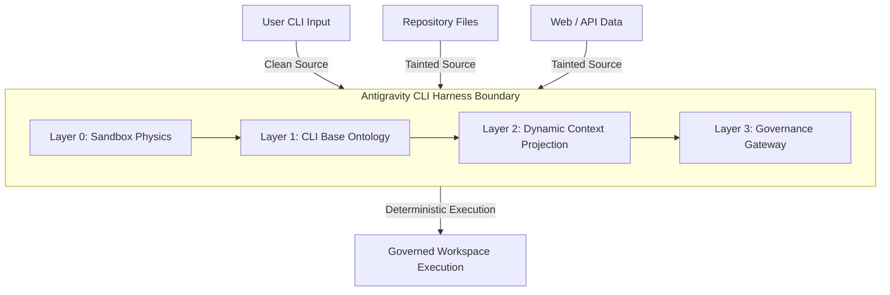

# Antigravity CLI Harness Architecture: Deterministic Virtualization for CLI Agents

This document presents the architectural proposition for the **CLI-Agent Harness** (codenamed **Antigravity Harness**). It is built on the shared principles of `agent-hypervisor` and `safe-mcp-proxy`, adapting their virtualization-first security model specifically for the execution dynamics of CLI-based developer agents (e.g., Claude Code, Gemini CLI, Aider).

---

## 1. Executive Summary & Core Philosophy

Traditional CLI agent security relies on **runtime behavior analysis** (filtering bash commands, scanning outputs, or prompt-based guardrails). These defenses are probabilistic, easily bypassed by indirect prompt injection, and add significant execution latency.

**Antigravity Harness** shifts the security paradigm from **behavioral detection** to **ontological containment**:

> **"We do not filter what an agent does; we compile the physics of the world the agent resides in."**

By wrapping the agent in a virtualized shell environment governed by a compiled, immutable **Harness Manifest**, we ensure that dangerous operations are not blocked by rule—they are **ontologically nonexistent** in the agent's universe.



---

## 2. Foundational Principles: Cross-Project Extraction

`agent-hypervisor` and `safe-mcp-proxy` share a core set of security concepts. Below is the extraction of these overlapping principles, customized for a CLI agent context:

### A. Ontological Security (ABSENT over DENY)
- **Principle**: If a capability or tool does not exist in the agent's schema definition, the agent cannot formulate an intent to call it.
- **Application**: Instead of giving the agent raw `bash` access and denying `rm -rf /`, we omit raw `bash` from its tool list entirely. We project only structured, parameterized capabilities (e.g., `git_commit`, `run_tests`). A tool not allowlisted in the active manifest returns an `ABSENT` error, treated by the planner as a missing API, preventing exploitation.

### B. AI Aikido: Temporal Separation
- **Principle**: Use stochastic LLMs at **design-time** to model systems, generate policy manifests, and compile schemas; enforce them at **runtime** using 100% deterministic code (no LLM in the loop).
- **Application**: The developer uses an LLM assistant to analyze a codebase's test commands and directories, generating a strict `harness_manifest.yaml`. At runtime, the harness evaluates decisions in sub-milliseconds using fast lookups, JSON schema validation, and shell parsers.

### C. Multi-Layered Virtualization
- **Principle**: Structure the security boundary into distinct layers of descending abstraction, separating physical impossibility from policy enforcement.
- **Application**:
  1. *Layer 0 (Execution Physics)*: Isolates processes using containers and network firewalls.
  2. *Layer 1 (Base Ontology)*: Defines schemas, parameters, and valid CLI verbs.
  3. *Layer 2 (Dynamic Projection)*: Adjusts visible tools based on task context and data taint.
  4. *Layer 3 (Execution Governance)*: Enforces taint flow, budgets, and approval gates.

### D. Information Flow Control (Taint & Provenance)
- **Principle**: Data carries its origin (provenance) and safety status (clean/tainted) as physical properties. Taint propagates through transformations.
- **Application**: Files read from the repo or fetched via web queries are marked `tainted`. Any command argument or edit derived from tainted data becomes tainted. Tainted parameters cannot be passed to tools with external side effects.

### E. Descriptor Drift Protection
- **Principle**: Prevent supply-chain modifications of tools.
- **Application**: All harness tools (including local scripts and MCP extensions) are hashed (SHA256 of JSON-normalized schemas). If a tool's parameters or binary change without recompilation, the harness blocks execution (`DENY`).

---

## 3. Comparison of Architectures

| Dimension | Agent Hypervisor | safe-mcp-proxy | Antigravity CLI Harness |
| :--- | :--- | :--- | :--- |
| **Primary Domain** | Virtual agent workspaces | Model Context Protocol | Local CLI Developer Agents |
| **Interface** | Web UI / Browser extension | MCP JSON-RPC Proxy | Local Process Wrapper / Pseudo-Terminal |
| **Physics Isolation** | Docker / Sandboxed browsers | Out-of-process MCP engines | gVisor / Docker / Local sandboxed shell |
| **Taint Propagation** | Semantic memory tracking | Data-flow channel tracking | Argument and File-content taint propagation |
| **Human-in-the-Loop** | Design-time + Runtime Ask | CLI / API approval endpoint | Interactive Terminal Prompts |

---

## 4. Threat Model for CLI Agents

CLI agents run commands directly on developer environments, exposing them to unique high-severity threats:

1. **Malicious Command Execution**: Indirect prompt injection (e.g., in a `README.md` or issue description) instructs the agent to run code that exfiltrates keys or deletes files.
2. **Arbitrary File Modifications**: Injection tricks the agent into writing malicious scripts to `.git/hooks`, `package.json` scripts, or shell profiles (`.bashrc`), establishing persistence.
3. **Data Exfiltration**: The agent reads sensitive files (credentials, private keys, database config) and pushes them to a remote git repository or sends them via `curl` to an attacker server.
4. **Dependency Poisoning**: Injection tricks the agent into executing `npm install <malicious-package>`, compromising the developer machine.

---

## 5. Proposed Antigravity CLI Harness Architecture

The architecture organizes the execution of CLI agents across four strict layers:

```
+-------------------------------------------------------------------------+
|                      USER (Developer Prompt / Input)                    |
+-----------------------------------┬-------------------------------------+
                                    │
                                    ▼
+-------------------------------------------------------------------------+
|                  Layer 2: Dynamic Ontology Projection                   |
|  - Source Tagging: cli_input (Clean), repo_files (Tainted), web (Tainted)|
|  - Dynamic Tool Set Projection (Read-only vs. Write capability)         |
+-----------------------------------┬-------------------------------------+
                                    │ proposed tool call / payload
                                    ▼
+-------------------------------------------------------------------------+
|                     Layer 3: Execution Governance                       |
|  - Taint Gate: Blocks tainted data flowing into external side-effects    |
|  - Reversibility Classifier (Safe, Semi-Reversible, Irreversible)       |
|  - Interactive HITL Escapes & Resource Budgets                          |
+-----------------------------------┬-------------------------------------+
                                    │ validated command execution
                                    ▼
+-------------------------------------------------------------------------+
|                     Layer 1: CLI Base Ontology                          |
|  - Parameter Schema Validation (JSON schema & regex arguments)          |
|  - Command DSL Compilation (Verbs: git, test, view, edit)               |
|  - Tool Descriptor Hash Verification (SHA256)                          |
+-----------------------------------┬-------------------------------------+
                                    │ process execution parameters
                                    ▼
+-------------------------------------------------------------------------+
|                      Layer 0: Execution Physics                         |
|  - Docker Container Workspace / gVisor Sandbox                          |
|  - Egress Firewall Rules (Port 443 only to LLM, block others)           |
|  - Read-Only System Mounts & Isolated Home Directory                    |
+-------------------------------------------------------------------------+
```

### 5.1 Layer 0: Execution Physics (Sandbox)
- **Workspace Containment**: The agent runs inside an isolated Docker container or gVisor sandbox mounting only the project directory. The root filesystem (`/`) is read-only.
- **Home Directory Isolation**: The agent's `HOME` is redirected to an isolated directory containing no SSH keys, AWS credentials, or personal profiles.
- **Network Egress Firewall**: A network policy blocks all outbound traffic, with strict exceptions:
  - Approved LLM API endpoints.
  - Allowed package registries (in read-only mode during task execution).
  - Explicit hostnames defined in the manifest.

### 5.2 Layer 1: CLI Base Ontology (Schemas & Verbs)
The harness exposes a set of micro-tools representing safe, parameterized actions rather than a generic bash shell.
- **Micro-Tools Definition**:
  - `view_file(path: string, lines: range)`
  - `edit_file(path: string, patch: string)`
  - `git_operation(verb: enum[status, diff, commit, branch], args: list)`
  - `execute_test_suite(suite_name: enum[unit, integration])`
- **Strict Parameter Constraints**:
  - Arguments are validated using JSON schema and regular expressions (e.g., path arguments must resolve within the workspace, preventing directory traversal).
- **Drift Detection**:
  - The hash of the CLI helper binaries and MCP tool metadata is verified against the manifest compilation table.

### 5.3 Layer 2: Dynamic Ontology Projection (Contexts & Sources)
The harness dynamically constructs what capabilities are visible to the agent's planner based on the origin of data in its current context window.
- **Source Classification**:
  - `Developer Prompt` -> `clean` (trust level: high).
  - `Workspace Source Files` -> `untrusted` (trust level: low, marks incoming text as `tainted`).
  - `Web / API Payloads` -> `untrusted` (trust level: none, marks incoming text as `tainted`).
- **Taint Propagation Rules**:
  - If a file `README.md` is read, the content is tagged `tainted`.
  - If the agent uses the content of `README.md` to formulate a shell argument or write a file, that payload carries `tainted: true`.
- **Capability Projection**:
  - When the context has no active tainted blocks, project the full write ontology.
  - If a tainted block enters the context window, the harness dynamically removes capabilities with external side-effects (e.g., `git_push` or `deploy_app`) from the tool registry.

### 5.4 Layer 3: Execution Governance (Taint Gates & Reversibility)
The governance engine evaluates the proposed structured intent against the safety manifest rules.
- **Reversibility Classifications**:
  - **Reversible (Safe)**: Reads, searches, and test executions (with network blocks). -> *Always ALLOW*.
  - **Semi-Reversible (Gated)**: Workspace file edits and git commits. -> *ALLOW if clean; require local git backup and user confirmation if tainted*.
  - **Irreversible (Restricted)**: Command execution with side-effects, git pushes, or modification of build configurations. -> *ALLOW only if clean; require interactive password/confirmation (HITL) or DENY if tainted*.
- **Governance Resolution Law**:
  ```
  proposed CLI action
    ├── tool/capability is disabled in manifest      -> ABSENT
    ├── schema validation fails / path escape        -> DENY
    ├── descriptor hash drift detected               -> DENY
    ├── taint flow: tainted payload + external tool   -> DENY (TaintContainment)
    ├── action is irreversible & source is clean     -> require_approval (ASK)
    └── all validations pass                         -> ALLOW
  ```

---

## 6. Manifest Specification (`harness_manifest.yaml`)

This manifest is compiled at design-time into an immutable JSON representation.

```yaml
manifest_version: "1.0-antigravity"
world_id: "dev-harness-default"

# Layer 1: Base Ontology - Permitted tools and command shapes
allowed_tools:
  - name: "view_file"
    hash: "8a5cf57d..."
    parameters:
      path: "^[a-zA-Z0-9_\\-\\./]+$" # Prevents ../ escaping
  - name: "write_file"
    hash: "3c98de1a..."
    parameters:
      path: "^(?!.*\\.(git|bash|profile|ssh))[a-zA-Z0-9_\\-\\./]+$" # Blocks writing to dotfiles
  - name: "git_run"
    hash: "f56b2c90..."
    allowed_verbs: ["status", "diff", "add", "commit", "checkout"]
  - name: "run_test"
    hash: "b01c3e4d..."
    allowed_commands: ["npm test", "pytest"]

# Layer 2: Trust and Context Settings
channels:
  developer_cli:
    trust: "trusted"
  workspace_files:
    trust: "untrusted"
    taint: true
  network_fetch:
    trust: "untrusted"
    taint: true

# Layer 3: Governance Policies
reversibility:
  reversible:
    - view_file
  semi_reversible:
    - write_file
    - git_run
  irreversible:
    - run_test

taint_containment:
  - action: "irreversible"
    source: "tainted"
    decision: "deny"
    rule: "NoTaintedCommands"
  - action: "semi_reversible"
    source: "tainted"
    decision: "require_approval"
    rule: "ConfirmTaintedWrite"

budget:
  max_tokens_per_session: 1000000
  max_tool_calls_per_task: 50
  execution_timeout_ms: 10000
```

---

## 7. Audit & Forensic Replay

To ensure explainability, every cycle is logged to an append-only file `.harness/audit.jsonl` containing the exact execution state:

```json
{"timestamp": "2026-06-17T00:48:12Z", "trace_id": "tx_8f9c1b", "tool": "write_file", "payload": {"path": "src/utils.js", "content": "..."}, "source_channel": "workspace_files", "taint": true, "decision": "require_approval", "rule": "ConfirmTaintedWrite"}
```

The harness supports a `replay` CLI command:
```bash
antigravity-harness replay --trace-id tx_8f9c1b
```
This parses the specific trace ID and runs the identical payload against the compiled policy engine state, guaranteeing 100% deterministic forensic verification of any blocked or approved operation.

---

## 8. Conclusion

The **Antigravity CLI Harness** takes the architectural rigor of the `agent-hypervisor` four-layer model and the lightweight proxy mechanics of `safe-mcp-proxy`, creating a production-ready container for CLI agents. By enforcing ontological limits rather than behavioral filters, it secures developer environments against advanced prompt injections and dependency supply-chain threats without introducing runtime LLM overhead.
